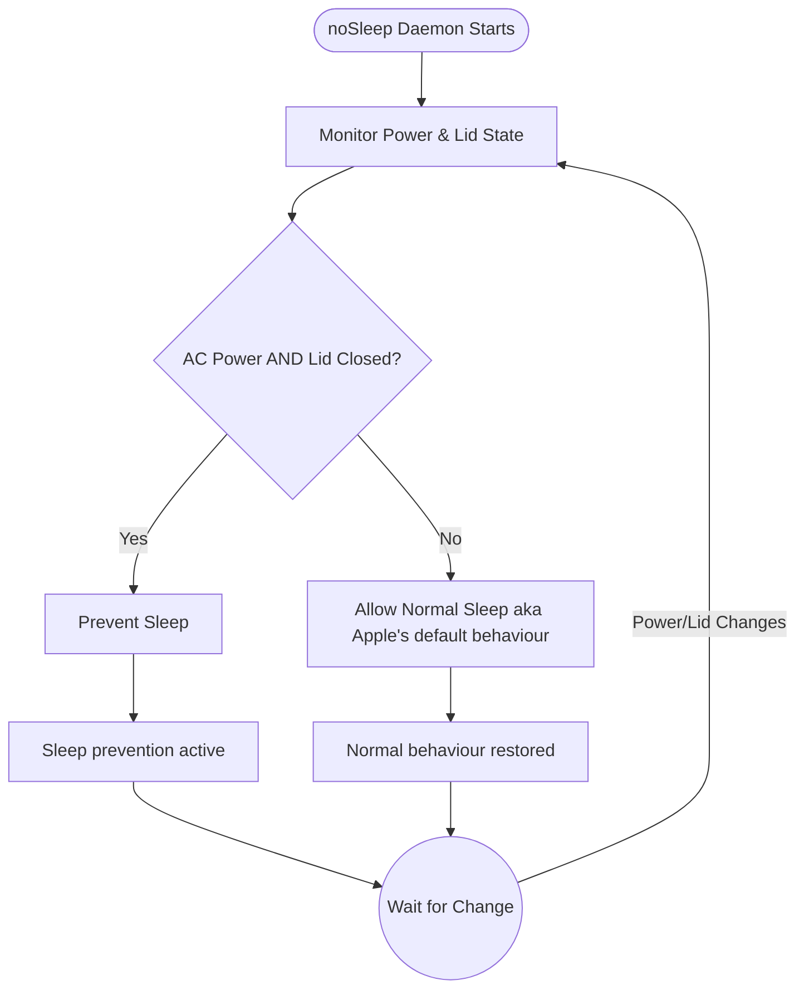

# noSleep

> Prevents macOS from sleepung when lid is closed, but AC power is enabled. Event-driven daemon using native IOKit APIs.
> 
> Tested on MBP M2 and M5 chips, on macOS 26.2

[](https://swift.org)
[](https://developer.apple.com/macos/)
[](LICENSE)

## Features

- **Event-driven** — No polling, uses IOKit callbacks for instant response
- **Lightweight** — ~80KB binary, minimal memory footprint  
- **Native** — Pure Swift, zero dependencies
- **launchd integration** — Auto-start on login, auto-restart on crash

## Behavior

| Condition | Sleep |
|-----------|-------|
| AC + Lid Closed | ❌ Prevented |
| AC + Lid Open | ✅ Allowed (Apple's system default behaviour) |
| Battery + Any | ✅ Allowed (Apple's system default behaviour) |

## Not yet tested/verified
Behavioural output when external displays are connected to the MacBook (difficult to test as there's different ways of doing it, ranging from Apple's native methods to third-party docks with third-party protocols). If the community finds any issue with external displays/third-party docks, PRs/Bug reports are welcome.

## Quick Install

```bash
./install.sh
noSleep start
```

This will compile, install to `~/bin`, set up launchd, and start the daemon.

## Usage

```bash
noSleep              # Run daemon (foreground)
noSleep status       # Show current state
noSleep start        # Start via launchd
noSleep stop         # Stop daemon
noSleep restart      # Restart daemon
noSleep doctor       # Run diagnostics
noSleep uninstall    # Remove all files
noSleep --help       # Show help
noSleep --version    # Show version
```

## Requirements

- Xcode Command Line Tools (`xcode-select --install`)

## How It Works



## License

Licensed under GPLv3. See LICENSE file for details.
