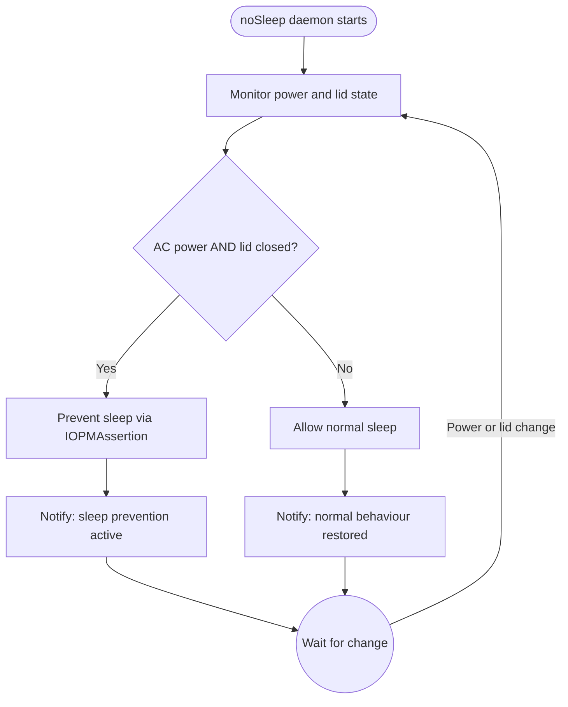

# noSleep

> Prevents macOS from sleeping when the lid is closed on AC power. Event-driven daemon using native IOKit APIs.
>
> Tested on MBP M2 and M5 chips, on macOS 26.2

[](https://swift.org)
[](https://developer.apple.com/macos/)
[](LICENSE)

## Features

- **Event-driven** -- No polling, uses IOKit callbacks for instant response
- **Lightweight** -- ~80KB binary, minimal memory footprint
- **Native** -- Pure Swift, zero dependencies
- **launchd integration** -- Auto-start on login, auto-restart on crash
- **Multi-user safe** -- Per-user lock file, no shared state between accounts

## Behaviour

| Condition | Result |
|-----------|--------|
| AC + Lid Closed | Sleep prevented |
| AC + Lid Open | Allowed (system default) |
| Battery + Any | Allowed (system default) |

## Not yet tested/verified

Behavioural output when external displays are connected to the MacBook (difficult to test as there are different ways of doing it, ranging from Apple's native methods to third-party docks with third-party protocols). If the community finds any issue with external displays or third-party docks, PRs and bug reports are welcome.

## Quick Install

```bash
./install.sh
noSleep start
```

This will compile, install to `~/bin`, set up launchd, and start the daemon. On Apple Silicon the install script detects your CPU model and compiles with `-target-cpu` for additional optimisation, falling back to a standard `-O` build if needed.

## Usage

```
noSleep daemon       Run daemon in foreground (used by launchd)
noSleep status       Show current power, lid, and daemon state
noSleep start        Start via launchd (auto-start on login)
noSleep stop         Stop daemon
noSleep restart      Restart daemon
noSleep doctor       Run diagnostics (read-only)
noSleep uninstall    Remove all installed files
noSleep --help       Show help
noSleep --version    Show version
```

## Requirements

- Xcode Command Line Tools (`xcode-select --install`)

## How It Works


```mermaid
flowchart TB
    START([noSleep daemon starts]) --> MONITOR[Monitor power and lid state]

    MONITOR --> CHECK{AC power AND lid closed?}

    CHECK -->|No| ALLOW[Allow normal sleep]
    CHECK -->|Yes| PREVENT[Prevent sleep via IOPMAssertion]

    PREVENT --> NOTIFY_ON[Notify: sleep prevention active]
    ALLOW --> NOTIFY_OFF[Notify: normal behaviour restored]

    NOTIFY_ON --> WAIT((Wait for change))
    NOTIFY_OFF --> WAIT

    WAIT -->|Power or lid change| MONITOR
```

IOKit fires `IOPMrootDomain` interest notifications on lid state changes and `IOPSNotificationCreateRunLoopSource` on power source changes. Both feed into a shared 150ms coalescing timer on the main run loop, so burst events (common on wake) trigger a single state evaluation rather than many. Notifications to the user are dispatched via `posix_spawn` (fire-and-forget) so the daemon never blocks waiting for `osascript` to complete.

## License

Licensed under GPLv3. See LICENSE file for details.
